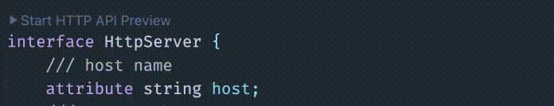

# IDL Language Server

An [OMG IDL](https://www.omg.org/spec/IDL/4.2/PDF) language server and VS Code
extension (`vscode-idl-language`) with the [xidl](https://github.com/xidl/xidl)
extension.

## Features

- Semantic tokens
- Format
- Diagnostics
- Go to definition
- Find references
- Rename
- HTTP API development

## Installation

Install the VS Code extension from the
[Marketplace](https://marketplace.visualstudio.com/items?itemName=cathaysia.vscode-idl-language):

1. Open the Extensions view (`Ctrl+Shift+X` / `Cmd+Shift+X`).
2. Search for `cathaysia.vscode-idl-language`.
3. Click Install.

## HTTP API Development

This project adds an [xidl](https://github.com/xidl/xidl) HTTP API development
extension that lets you declare HTTP endpoints, launch a Swagger UI, and get
live previews.

## VS Code Extension

The extension bundles a platform-specific `idl-language-server` binary on
release. If you need to override the server path locally, set
`IDL_LANGUAGE_SERVER_PATH`.
